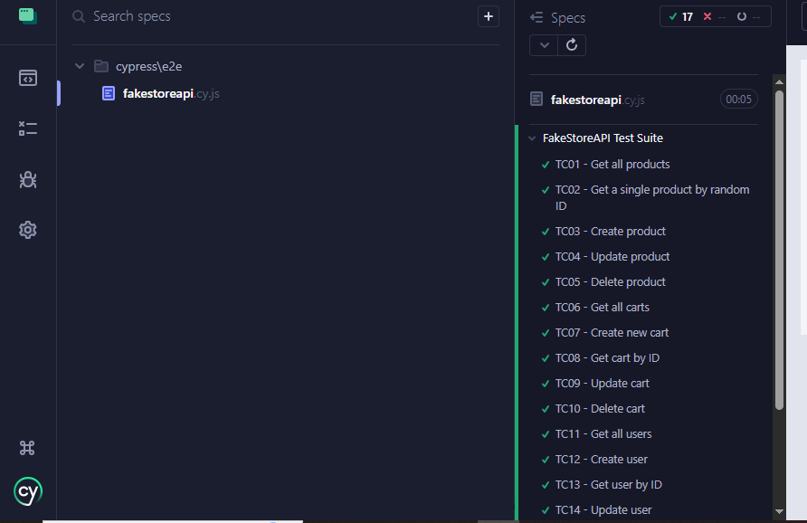

# FakeStore API Automation & Performance Tests

Bu projede FakeStore API kullanılarak Cypress ile otomatik API testleri yazılmıştır.
Artillery ile performans testleri yapılmıştır

## Test Kapsamı (Cypress)
- GET / POST / PUT / DELETE HTTP metodları
- Header kontrolü (User-Agent, Content-Type)
- Query parameter kullanımı (limit)
- Rastgele veri kullanımı
- Response body doğrulama
- Status code kontrolü
- Response time (performans) testi

Toplam 17 adet otomatik test bulunmaktadır.

## Cypress Test Sonucu

Aşağıda Cypress testlerinin başarılı şekilde çalıştığını gösteren ekran görüntüsü yer almaktadır:



## Çalıştırma
```bash
npm install
npx cypress open


##  Performance Test (Artillery)

Bu projede FakeStore API için **Artillery** kullanılarak bir performans (yük) testi oluşturulmuştur.

##  Test Yapısı

Yük testi iki fazdan oluşmaktadır:

- **Warm Up Phase:**  
  60 saniye boyunca saniyede 5 kullanıcı ile sistem ısıtılmıştır.

- **Stress Test Phase:**  
  120 saniye boyunca saniyede 20 kullanıcı ile stres testi uygulanmıştır.

##  Test Akışı (Scenario)

Senaryo aşağıdaki adımları içermektedir:

- `GET /products` → Ürün listesinin alınması  
- `POST /carts` → CSV dosyasından okunan verilerle sepet oluşturulması  

POST isteği için veriler `payload.csv` dosyasından alınmıştır.  
(`userId`, `date`, `products` alanları kullanılmaktadır.)

##  Performans Kriterleri 

Test sırasında aşağıdaki metrikler doğrulanmıştır:

- `http.response_time.p95 < 500 ms`  
- `http.response_time.p99 < 1000 ms`  
- `http.requests.failed = 0`

##  Çalıştırma

```bash
npm install -g artillery
artillery run fakestoreapi.yml
